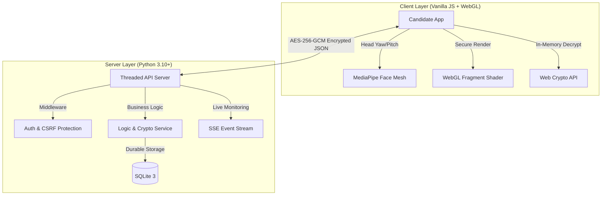

<!-- 
RESUME BULLET:
Developed a high-integrity assessment platform using WebGL shaders and MediaPipe computer vision to implement biometric angle-dependent rendering; secured data pipeline via AES-256-GCM encrypted content delivery and HMAC-SHA256 rendering proofs.
-->

# 3D Ambi: Biometric Anti-Cheat Assessment Engine

**Secure, angle-dependent assessment content rendered in real-time using computer vision and WebGL.**

[](#-security-architecture)
[](https://github.com/Rs111104/3d-ambigram/actions)
[](LICENSE)

3D Ambi is a production-grade proctoring solution that solves the "side-viewer" cheating problem. By tracking a candidate's head orientation in 3D space, the system dynamically cross-fades real exam content into plausible decoys for anyone not facing the screen directly.

[**Interactive WebGL Demo** (Simulated Rotation)](demo.html)

---

## 🚀 Key Innovation: The "Privacy Filter" Shader

Unlike traditional proctoring that simply flags behavior, 3D Ambi makes cheating physically impossible. 
- **Direct View:** Crystal-clear question rendering.
- **Peripheral View:** Real-time cross-fade into a decoy question using a custom Gaussian blur + parallax offset WebGL shader.
- **Biometric Baseline:** Uses MediaPipe Face Mesh to calibrate to the candidate's specific facial structure and lighting.

---

## 🛠️ System Architecture

Built with a decoupled, modular architecture designed for security-first environments.



---

## 🛡️ Security Architecture (Excellence Pass)

1.  **Encrypted Content Pipeline:** Questions never exist in the DOM. They are delivered as **AES-256-GCM** encrypted blobs. The decryption key is derived on-the-fly and resides only in the client's volatile memory.
2.  **Cryptographic Rendering Proofs:** To prevent headless browser automation, every answer must include an **HMAC-SHA256 signature**. This signature is only valid if the client proves it was actively rendering the question at an aligned angle.
3.  **Real-Time Forensic Auditing:** Administrators can scrub through a candidate's behavioral timeline with millisecond precision via **Server-Sent Events (SSE)**.

---

## 📱 Experience Tour

### For Candidates
- **Zero-Flicker Resume:** Sessions persist in local storage; refresh or crash recovery is seamless.
- **Accessibility First:** Full ARIA compliance, keyboard navigation, and OS-level dark mode support.
- **Biometric Checklist:** Professional pre-test verification of camera, lighting, and face alignment.

### For Proctors
- **Intelligence Dashboard:** Automated integrity scoring (PASS/WARN/REVIEW) based on behavioral heuristics.
- **Forensic Replay:** Granular event logs (tab switches, face loss, inactivity) grouped into actionable incidents.
- **Data Portability:** One-click CSV export of full audit logs for institutional record-keeping.

---

## 🏁 Quick Start

1.  **Clone & Install:**
    ```bash
    git clone https://github.com/Rs111104/3d-ambigram.git
    cd 3d-ambigram
    pip install cryptography python-dotenv
    ```
2.  **Initialize & Seed:**
    ```bash
    python setup.py
    ```
3.  **Launch:**
    ```bash
    python backend/server.py
    ```
    *Admin Credentials: `admin / admin123`*

---
*Developed as a demonstration of high-performance browser security and computer vision integration.*
